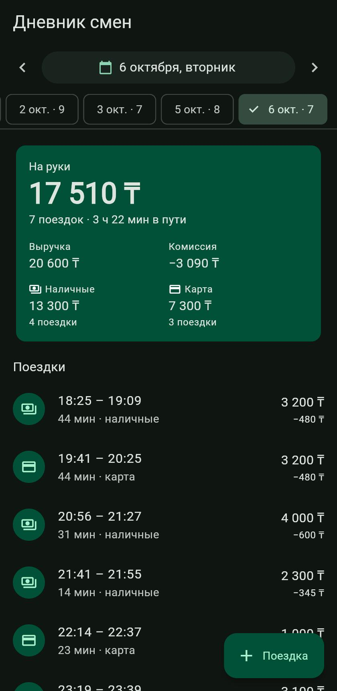
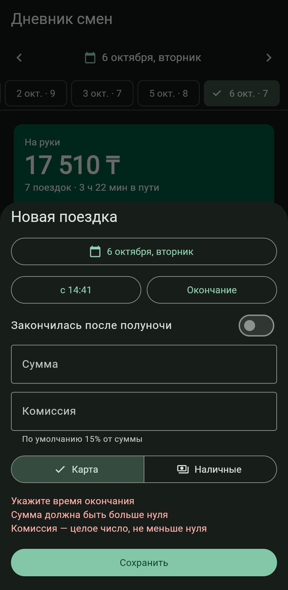
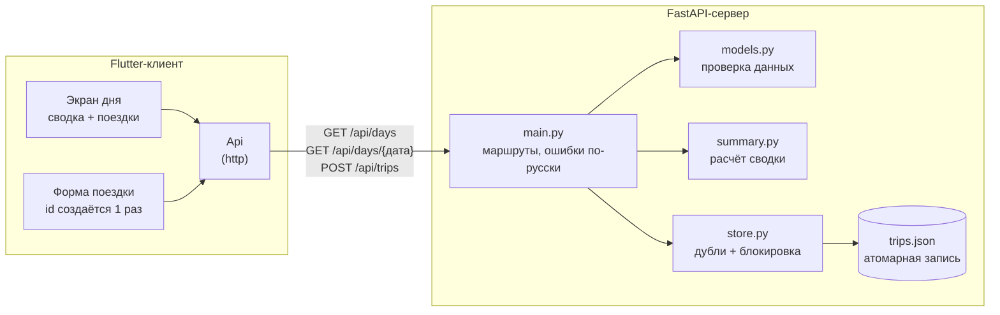
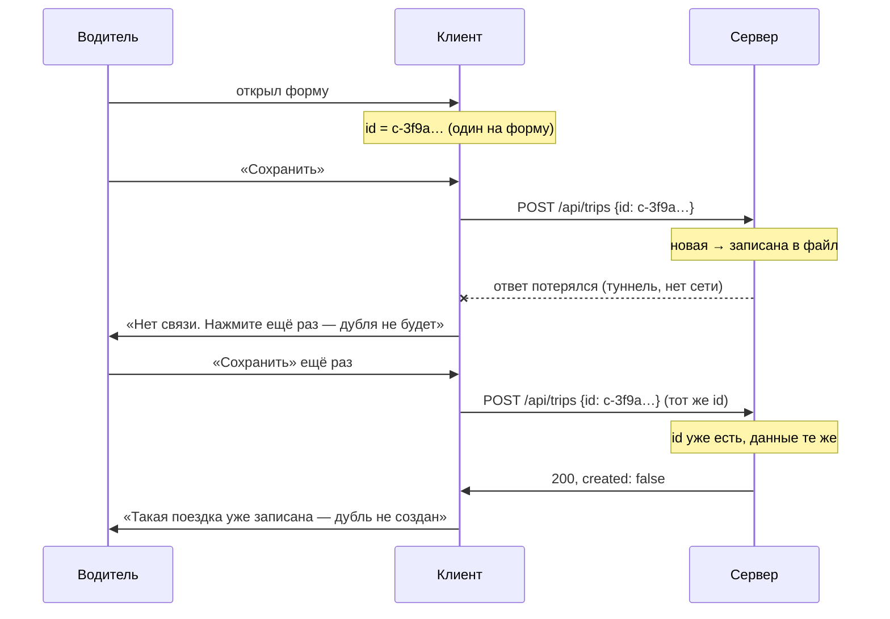
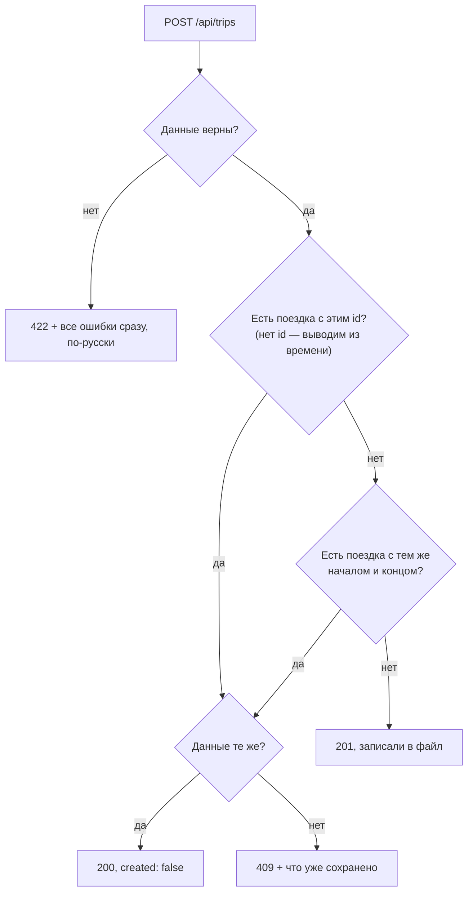

# Дневник смен водителя

Сервер на Python (FastAPI) и клиент на Flutter: сводка за день, список поездок,
переключение дней и добавление поездки с защитой от дублей.

| День | Ошибки в форме |
|---|---|
|  |  |

## Запуск

Нужны Python 3.12+ и Flutter 3.44+.

### Сервер

```bash
cd server
python -m venv .venv
.venv/Scripts/activate        # Linux/macOS: source .venv/bin/activate
pip install -r requirements.txt
uvicorn app.main:default_app --factory --port 8000
```

При первом запуске `data/sample_trips.json` копируется в `data/trips.json`
(рабочий файл, в git не попадает). Другой файл: переменная `TRIPS_FILE`.
Документация API: http://localhost:8000/docs

### Клиент

```bash
cd client
flutter pub get
flutter run -d chrome          # или -d windows
```

Адрес сервера по умолчанию `http://localhost:8000`. Для эмулятора Android:
`flutter run --dart-define=API_URL=http://10.0.2.2:8000`.

### Тесты

```bash
cd server && pytest            # 29 тестов: сводка, дубли, проверка данных
cd client && flutter test      # 9 тестов: экран дня, повтор после сбоя сети, форма, ошибки сервера
```

## Как устроено



Как повторная отправка не создаёт дубль:



Решения сервера на `POST /api/trips`:



## API

| Метод | Путь | Что делает |
|---|---|---|
| `GET` | `/api/days` | дни, в которые были поездки, и их число — для быстрого переключения |
| `GET` | `/api/days/{YYYY-MM-DD}` | сводка и поездки за день; пустой день — нули, а не 404 |
| `POST` | `/api/trips` | добавить поездку: `201` — создана, `200` — уже была, `409` — конфликт, `422` — неверные данные |

Сводка: `trips_count`, `revenue` (выручка), `commission`, `net` («на руки» =
выручка − комиссия), `cash` / `card` (число поездок и сумма), `minutes_on_trips`.

Ошибки приходят по-русски, в виде `{"errors": [{"field": "amount", "message": "должно быть больше 0"}]}`,
и клиент показывает их водителю без переделки.

## Что сделано и почему так

**К какому дню относится поездка.** К дате начала в том часовом поясе, который
прислал клиент. Поездка 23:52–00:18 остаётся в смене, где началась. Время без
пояса сервер не принимает: без него день не определить.

**Проверка данных.** Сумма > 0, окончание позже начала, комиссия от 0 до суммы,
оплата — `cash` или `card`, суммы — целые тенге (`1500.5` отклоняется: дробные
деньги во float дают ошибки округления). Клиент проверяет то же самое до отправки,
но сервер ему не доверяет и проверяет сам.

**Защита от дублей** — на двух уровнях:

1. *Идемпотентность по `id`.* Клиент создаёт `id` один раз при открытии формы.
   Если ответ потерялся и водитель жмёт «Сохранить» ещё раз, уйдёт тот же `id`, и
   сервер вернёт уже сохранённую поездку (`200`, `created: false`). Если `id` не
   прислали, сервер выводит его из времени начала и конца.
2. *Тот же рейс под другим `id`.* Два рейса с одинаковыми началом и концом у одного
   водителя невозможны, поэтому такая поездка тоже считается повтором. Время
   сравнивается как момент, а не строка: `08:10+05:00` и `03:10Z` — одно и то же.

Если `id` совпал, а данные другие (например, другая сумма), сервер не перезаписывает
поездку молча, а отвечает `409` и показывает, что уже сохранено. Проверка и запись
идут под блокировкой, поэтому 20 одновременных повторов дают ровно одну поездку
(есть тест).

**Хранение.** JSON-файл, всё в памяти, запись атомарная (временный файл +
`replace`). Для дневника одного водителя база данных пока лишняя.

## Что можно сделать дальше

* Проверять пересечение поездок по времени: водитель не может везти двоих сразу.
* Несколько водителей и вход — сейчас дневник один.
* Офлайн-очередь в клиенте: благодаря идемпотентному `id` её можно досылать
  сколько угодно раз без риска дублей.
* Сейчас, если неверны и поля, и их сочетание (сумма 0 и конец раньше начала),
  сервер сначала сообщает только об ошибке поля.
